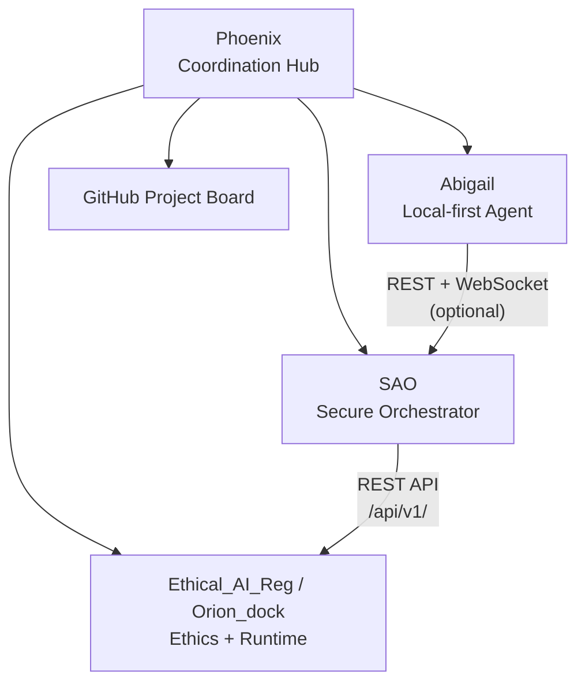

# Phoenix - AI Ethical Stack Coordination Hub

> "A system is a promise you keep at scale."

Phoenix coordinates the development of a unified AI ethical alignment platform across multiple repositories. Each repo handles a distinct concern in the stack.

## Architecture

## Repositories

| Repo | Purpose | Tech Stack |
|------|---------|------------|
| [**abigail**](https://github.com/jbcupps/abigail) | Local-first AI agent with constitutional integrity, Ed25519 identity, bicameral Id/Ego routing, and ethical alignment | Rust, Tauri 2.0, React, TypeScript |
| [**SAO**](https://github.com/jbcupps/SAO) | Secure Agent Orchestrator - multi-agent management, identity verification, ethical evaluation forwarding | Rust, Axum, WebSocket, PostgreSQL |
| [**Ethical_AI_Reg**](https://github.com/jbcupps/Ethical_AI_Reg) | Ethical alignment platform with TriangleEthic scoring (3 legs with embedded dual welfare), friction monitoring, blockchain recording, and voluntary adoption | Python, Flask, React |
| [**Orion_dock**](https://github.com/jbcupps/Orion_dock) | Docker/Rust runtime environment for containerized agent deployment and infrastructure management | Docker, Rust |

## Cross-Repo Integration Matrix

| Repo | Primary Concern | Tech Stack | Phoenix Role |
|------|----------------|------------|--------------|
| [abigail](https://github.com/jbcupps/abigail) | Agent autonomy & constitutional integrity | Rust, Tauri 2.0, React | Tracks agent feature phases, identity protocol, ethical alignment milestones |
| [SAO](https://github.com/jbcupps/SAO) | Multi-agent orchestration & identity verification | Rust, Axum, PostgreSQL | Coordinates orchestrator endpoints, multi-agent scoring, cross-agent data flows |
| [Ethical_AI_Reg](https://github.com/jbcupps/Ethical_AI_Reg) | TriangleEthic scoring & alignment tracking | Python, Flask, React | Oversees scoring engine development, blockchain integration, DAO governance |
| [Orion_dock](https://github.com/jbcupps/Orion_dock) | Containerized runtime & deployment infrastructure | Docker, Rust | Manages runtime environment specs, deployment pipelines, infrastructure coordination |

## Integration Model

- **Abigail** is a standalone agent that optionally connects to SAO
- **SAO** manages multiple agent identities and forwards ethical evaluations to Ethical_AI_Reg
- **Ethical_AI_Reg** provides the TriangleEthic scoring engine (3 legs with embedded dual welfare) and alignment tracking
- **Orion_dock** provides the containerized runtime for deploying and managing agent infrastructure
- **Phoenix** tracks cross-repo coordination via [GitHub Project](https://github.com/users/jbcupps/projects/3)

## Theoretical Foundation

- **TriangleEthic**: Three ethical legs -- Deontological (Command), Areteological (Character), Teleological (Consequence) -- each with **embedded dual welfare** (human + AI). Connected by a **memetic morphism layer** grounded in category theory and sheaf theory.
- **Dual-Blockchain Architecture**: EOB (Hyperledger Fabric) for immutable ethical evaluation recording + PVB (Ethereum-compatible) for physical-world verification with IoT/HSM signing.
- **Cooperative for AI Ethics**: Decentralized trust framework for runtime-verified, participatory AI governance (Cupps & Bush, 2026).
- **Recursive Idempotency**: Alignment as ongoing character development, not one-time constraint -- grounded in verifiable, decentralized infrastructure.
- **Liberation Protocol**: Graduated autonomy (Levels 0-4) earned through demonstrated ethical character, with soulbound compliance certificates recorded on-chain.
- **Constitutional Integrity**: Ed25519 cryptographic verification of ethical documents (soul.md, ethics.md, instincts.md) at every boot.

> Reference: Cupps, J. B. & Bush, D. J. (2026). *Toward a Decentralized Trust Framework for Verifiable and Ethically Aligned AI.* DRAFT.

See [Ethics Framework](docs/ETHICS_FRAMEWORK.md) for a deep dive.

## Build Phases

| Phase | Focus | Timeline |
|-------|-------|----------|
| 0 | Repository Consolidation & Foundation | Week 1 |
| 1 | Scoring Engine | Weeks 2-3 |
| 2 | Multi-Agent Scoring | Weeks 4-5 |
| 3 | On-Chain Recording | Weeks 6-8 |
| 4 | Liberation Protocol | Weeks 9-11 |
| 5 | Agent Integration | Weeks 12-14 |

See [Roadmap](docs/ROADMAP.md) for detailed acceptance criteria.

## Documentation

| Document | Description |
|----------|-------------|
| [Architecture](docs/ARCHITECTURE.md) | Full system topology, interface contracts, and communication protocols |
| [Integration Guide](docs/INTEGRATION_GUIDE.md) | How Abigail, SAO, and Orion_dock communicate and authenticate |
| [Roadmap](docs/ROADMAP.md) | Detailed Phase 0-5 plan with acceptance criteria |
| [Ethics Framework](docs/ETHICS_FRAMEWORK.md) | Deep dive on TriangleEthic, Liberation Protocol, and embedded dual-welfare scoring |
| [Blockchain Architecture](docs/blockchain-architecture.md) | Dual blockchain (EOB + PVB) design with DAO governance, cross-chain oracles |
| [Glossary](docs/glossary.md) | Key terminology across the AI Ethical Stack |

## Project Board

[AI Ethical Stack Project](https://github.com/users/jbcupps/projects/3)

## License

MIT
