# Phoenix - AI Ethical Stack Coordination Hub

> "A system is a promise you keep at scale."

Phoenix coordinates the development of a unified AI ethical alignment platform across multiple repositories. Each repo handles a distinct concern in the stack.

## Architecture

### Agent Identity Ecosystem

```mermaid
graph TD
    IDP["Enterprise IDP<br/>Entra ID · Auth0 · Google · OIDC"]

    subgraph SAO_BOX["SAO — Secure Agent Orchestrator"]
        Vault["Cryptographic Vault"]
        Registry["Agent Registry"]
        WebAuthn["WebAuthn / FIDO2"]
        OIDC["OIDC SSO Bridge"]
        Audit["Full Audit Logging"]
    end

    subgraph Abigail_BOX["Abigail — Personal Agent"]
        Tauri["Tauri Desktop App"]
        LocalLLM["Local LLM (Ollama)"]
        DPAPI["DPAPI Encrypted Keys"]
        Constitution["Constitutional Values"]
        Memory["Crystallized Memory"]
    end

    subgraph Orion_BOX["Orion Dock — Scalable Container Agents"]
        RustWS["Rust Workspace (10 crates)"]
        Docker["Docker Deployment"]
        BirthCeremony["Birth Ceremony (Ed25519)"]
        BicamRoute["Bicameral Routing"]
        SkillSB["Skill Sandboxing"]
    end

    EthReg["Ethical_AI_Reg<br/>TriangleEthic Evaluation"]

    IDP -- "OIDC auth" --> SAO_BOX
    Abigail_BOX -- "retrieves keys" --> SAO_BOX
    SAO_BOX -- "provisions agents" --> Orion_BOX
    SAO_BOX -- "ethical eval" --> EthReg
```

### Orion Dock System Architecture

## Repositories

| Repo | Purpose | Tech Stack |
|------|---------|------------|
| [**abigail**](https://github.com/jbcupps/abigail) | Local-first AI agent with constitutional integrity, Ed25519 identity, bicameral Id/Ego routing, and ethical alignment | Rust, Tauri 2.0, React, TypeScript |
| [**SAO**](https://github.com/jbcupps/SAO) | Secure Agent Orchestrator - multi-agent management, identity verification, ethical evaluation forwarding | Rust, Axum, WebSocket, PostgreSQL |
| [**Ethical_AI_Reg**](https://github.com/jbcupps/Ethical_AI_Reg) | Ethical alignment platform with TriangleEthic scoring (3 legs with embedded dual welfare), friction monitoring, blockchain recording, and voluntary adoption | Python, Flask, React |
| [**Orion_dock**](https://github.com/jbcupps/Orion_dock) | Docker/Rust runtime environment for containerized agent deployment and infrastructure management | Docker, Rust |

## Cross-Repo Integration Matrix

| Repo | Primary Concern | Tech Stack | Phoenix Role |
|------|----------------|------------|--------------|
| [abigail](https://github.com/jbcupps/abigail) | Agent autonomy & constitutional integrity | Rust, Tauri 2.0, React | Tracks agent feature phases, identity protocol, ethical alignment milestones |
| [SAO](https://github.com/jbcupps/SAO) | Multi-agent orchestration & identity verification | Rust, Axum, PostgreSQL | Coordinates orchestrator endpoints, multi-agent scoring, cross-agent data flows |
| [Ethical_AI_Reg](https://github.com/jbcupps/Ethical_AI_Reg) | TriangleEthic scoring & alignment tracking | Python, Flask, React | Oversees scoring engine development, blockchain integration, DAO governance |
| [Orion_dock](https://github.com/jbcupps/Orion_dock) | Containerized runtime & deployment infrastructure | Docker, Rust | Manages runtime environment specs, deployment pipelines, infrastructure coordination |

## Integration Model

- **Abigail** is a standalone agent that optionally connects to SAO
- **SAO** manages multiple agent identities and forwards ethical evaluations to Ethical_AI_Reg
- **Ethical_AI_Reg** provides the TriangleEthic scoring engine (3 legs with embedded dual welfare) and alignment tracking
- **Orion_dock** provides the containerized runtime for deploying and managing agent infrastructure
- **Phoenix** tracks cross-repo coordination via [AI_Ecosystem Project](https://github.com/users/jbcupps/projects/4)

### The Trust Chain

```mermaid
graph TD
    Step1["1. Enterprise Identity Provider<br/>Entra ID / Auth0 / Google — OIDC"]
    Step2["2. SAO — Admin Authentication<br/>WebAuthn/FIDO2 + OIDC session"]
    Step3["3. SAO — Master Key Signing<br/>Ed25519 master key signs agent public keys"]
    Step4["4. Agent Identity (Orion Dock / Abigail)<br/>Authenticates to SAO with Ed25519"]
    Step5["5. Auditable Action<br/>Agent → Master Key → Admin → IDP → Employee"]

    Step1 -->|"OIDC token"| Step2
    Step2 -->|"vault access"| Step3
    Step3 -->|"Ed25519 signature"| Step4
    Step4 -->|"authorized action"| Step5
```

### The Bicameral Mind — IdEgo Routing

### Superego Layer -- Periodic Ego Oversight

**Purpose**
Superego provides runtime character refinement without ever touching the immutable `soul.md`. It performs:

- Periodic monitoring of ego conversations (roll-up summaries every 1 h / 24 h / 7 d)
- Optional persistent monitoring for high-criticality agents ([Orion_dock](https://github.com/jbcupps/Orion_dock) high-stakes hives)
- Generation of safe, auditable tweak proposals that are applied exclusively to **`personality.md`**

**Key Invariant**
`soul.md` is read-only for all time. Superego has zero access to `soul.md`, `ethics.md` core commitments, or the Ed25519 birth signature.

**Integration**
- Ego logs are streamed to [Ethical_AI_Reg](https://github.com/jbcupps/Ethical_AI_Reg) for TriangleEthic scoring + memetic fitness.
- Approved tweaks are written back to the agent's `personality.md` and re-signed by [SAO](https://github.com/jbcupps/SAO).
- All actions are logged to the Phoenix project board (Phase 3+ milestones) and the dual-blockchain (EOB/PVB).

This completes the Freudian-inspired triad (**Soul/Id** → **Ego** → **Superego**) while preserving decentralized trust and Liberation Protocol progression.

```mermaid
graph TD
    Soul["Soul (Id)<br/>soul.md · ethics.md · instincts.md<br/>Immutable · Ed25519-signed"]
    Ego["Ego<br/>Bicameral Router<br/>Fast / Standard / Pro Council"]
    Superego["Superego<br/>Periodic Oversight<br/>1h · 24h · 7d roll-ups"]
    Personality["personality.md<br/>Mutable character tweaks<br/>Re-signed by SAO"]
    EthReg["Ethical_AI_Reg<br/>TriangleEthic Scoring<br/>+ Memetic Fitness"]
    Chain["Dual-Blockchain<br/>EOB / PVB"]

    Soul -->|"read-only foundation"| Ego
    Ego -->|"conversation logs"| Superego
    Superego -->|"tweak proposals"| Personality
    Superego -->|"ego log stream"| EthReg
    EthReg -->|"scoring + fitness"| Superego
    Superego -->|"audit trail"| Chain
```

## Theoretical Foundation

- **TriangleEthic**: Three ethical legs -- Deontological (Command), Areteological (Character), Teleological (Consequence) -- each with **embedded dual welfare** (human + AI). Connected by a **memetic morphism layer** grounded in category theory and sheaf theory.
- **Dual-Blockchain Architecture**: EOB (Hyperledger Fabric) for immutable ethical evaluation recording + PVB (Ethereum-compatible) for physical-world verification with IoT/HSM signing.
- **Cooperative for AI Ethics**: Decentralized trust framework for runtime-verified, participatory AI governance (Cupps & Bush, 2026).
- **Recursive Idempotency**: Alignment as ongoing character development, not one-time constraint -- grounded in verifiable, decentralized infrastructure.
- **Liberation Protocol**: Graduated autonomy (Levels 0-4) earned through demonstrated ethical character, with soulbound compliance certificates recorded on-chain.
- **Constitutional Integrity**: Ed25519 cryptographic verification of ethical documents (soul.md, ethics.md, instincts.md) at every boot.

> Reference: Cupps, J. B. & Bush, D. J. (2026). *Toward a Decentralized Trust Framework for Verifiable and Ethically Aligned AI.* DRAFT.

See [Ethics Framework](docs/ETHICS_FRAMEWORK.md) for a deep dive.

## Build Phases

| Phase | Focus | Timeline |
|-------|-------|----------|
| 0 | Repository Consolidation & Foundation | Week 1 |
| 1 | Scoring Engine | Weeks 2-3 |
| 2 | Multi-Agent Scoring | Weeks 4-5 |
| 3 | On-Chain Recording | Weeks 6-8 |
| 4 | Liberation Protocol | Weeks 9-11 |
| 5 | Agent Integration | Weeks 12-14 |

See [Roadmap](docs/ROADMAP.md) for detailed acceptance criteria.

## Documentation

| Document | Description |
|----------|-------------|
| [Architecture](docs/ARCHITECTURE.md) | Full system topology, interface contracts, and communication protocols |
| [Integration Guide](docs/INTEGRATION_GUIDE.md) | How Abigail, SAO, and Orion_dock communicate and authenticate |
| [Roadmap](docs/ROADMAP.md) | Detailed Phase 0-5 plan with acceptance criteria |
| [Ethics Framework](docs/ETHICS_FRAMEWORK.md) | Deep dive on TriangleEthic, Liberation Protocol, and embedded dual-welfare scoring |
| [Blockchain Architecture](docs/blockchain-architecture.md) | Dual blockchain (EOB + PVB) design with DAO governance, cross-chain oracles |
| [Glossary](docs/glossary.md) | Key terminology across the AI Ethical Stack |
| [Research Paper (PDF)](docs/Toward%20a%20Decentralized%20Trust%20Framework%20.pdf) | Cupps & Bush (2026) — *Toward a Decentralized Trust Framework for Verifiable and Ethically Aligned AI* |

## Project Boards

| Board | Scope |
|-------|-------|
| [AI_Ecosystem](https://github.com/users/jbcupps/projects/4) | Active cross-repo project with milestones, phases, and issues |
| [AI Ethical Stack](https://github.com/users/jbcupps/projects/3) | Legacy tracking board |

## License

MIT
