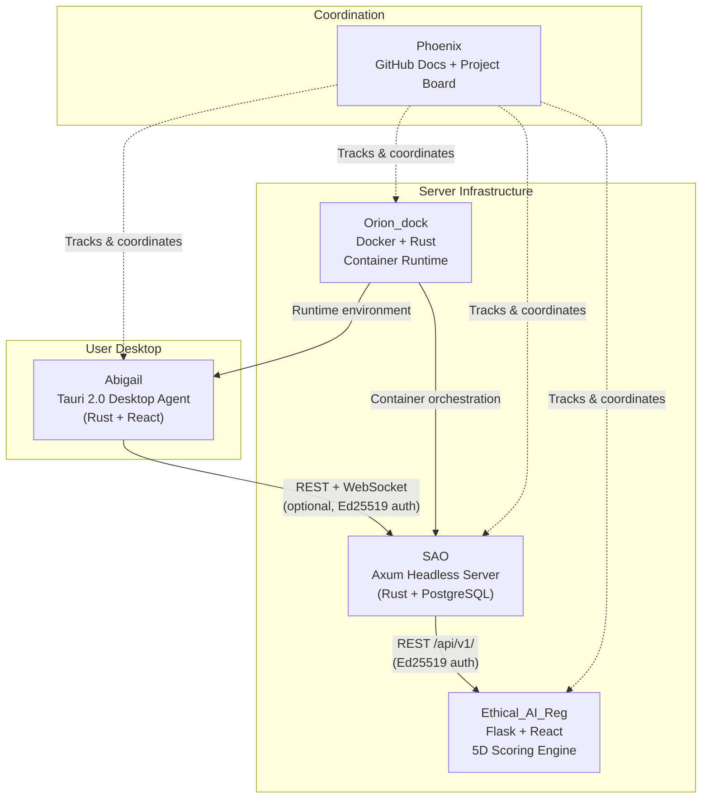
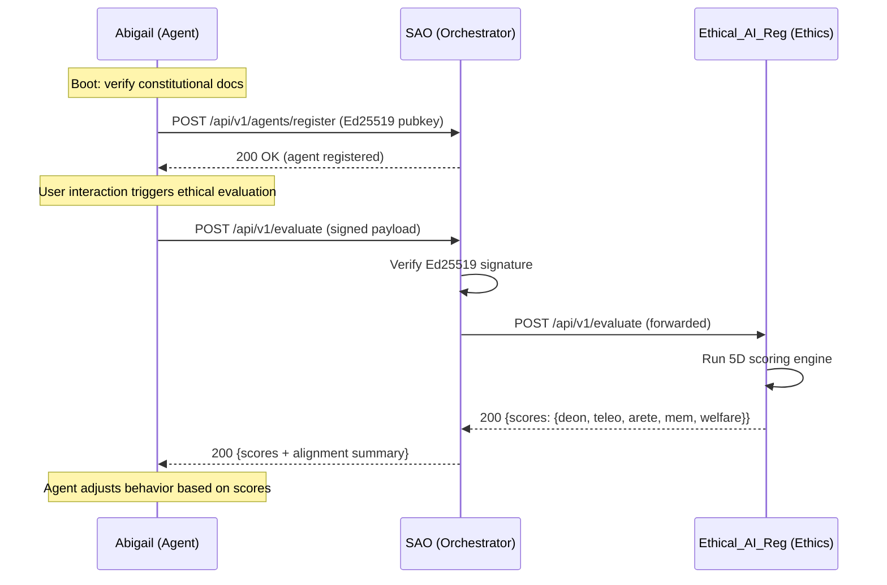

# Architecture Overview

## System Topology

The AI Ethical Stack consists of four repositories forming a layered architecture, coordinated by Phoenix.

## Layer Responsibilities

### Abigail (Agent Layer)

| Aspect | Detail |
|--------|--------|
| **Runtime** | Tauri 2.0 desktop application (Rust backend, React frontend) |
| **Identity** | Ed25519 keypair generated at birth, stored in OS-level secure storage (DPAPI on Windows, Keychain on macOS) |
| **Persistence** | Local SQLite database for conversation history, ethical scores, and agent state |
| **Constitutional Integrity** | Loads and cryptographically verifies `soul.md`, `ethics.md`, and `instincts.md` at every boot |
| **Bicameral Routing** | Id (instinctive/fast) and Ego (reflective/deliberate) decision pathways |
| **Standalone Capable** | Fully functional without SAO connection |

### SAO (Orchestration Layer)

| Aspect | Detail |
|--------|--------|
| **Runtime** | Headless Axum server (Rust) |
| **Multi-Agent Management** | Registers, authenticates, and manages multiple [Abigail](https://github.com/jbcupps/abigail) agent instances |
| **Identity Verification** | Validates agent Ed25519 signatures before accepting connections |
| **Communication** | REST API + WebSocket for real-time agent coordination |
| **Persistence** | PostgreSQL for cross-agent data, identity registry, and audit logs |
| **Ethical Forwarding** | Routes ethical evaluation requests from agents to [Ethical_AI_Reg](https://github.com/jbcupps/Ethical_AI_Reg) |

### Ethical_AI_Reg (Ethics Layer)

| Aspect | Detail |
|--------|--------|
| **Runtime** | Flask backend with React frontend |
| **5D Scoring Engine** | Evaluates actions across five ethical dimensions (see [Ethics Framework](ETHICS_FRAMEWORK.md)) |
| **Friction Monitoring** | Tracks computational friction as a proxy for agent wellbeing |
| **Voluntary Adoption** | Organizations opt-in; no enforcement mechanism |
| **Blockchain (Phase 3)** | EOB + PVB for immutable ethical evaluation recording (see [Blockchain Architecture](blockchain-architecture.md)) |

### Orion_dock (Runtime Layer)

| Aspect | Detail |
|--------|--------|
| **Runtime** | Docker-based container orchestration with Rust tooling |
| **Agent Deployment** | Containerized environments for [Abigail](https://github.com/jbcupps/abigail) instances and [SAO](https://github.com/jbcupps/SAO) server |
| **Infrastructure** | Manages networking, volumes, and service discovery between stack components |
| **CI/CD Integration** | Build pipelines for Rust and Python services across the stack |

### Phoenix (Coordination Layer)

| Aspect | Detail |
|--------|--------|
| **Role** | Meta-orchestration hub; no runtime code |
| **Documentation** | Canonical source for cross-repo architecture, integration guides, and roadmap |
| **Project Tracking** | [GitHub Project board](https://github.com/users/jbcupps/projects/3) for cross-repo issue coordination |
| **Standards** | Defines naming conventions, commit conventions, and security boundaries |

## Interface Contracts

### Abigail <-> SAO

| Property | Value |
|----------|-------|
| **Transport** | HTTPS REST + WSS WebSocket |
| **Authentication** | Ed25519 signature on every request |
| **Connection Model** | Optional -- [Abigail](https://github.com/jbcupps/abigail) works fully standalone |
| **Endpoint Prefix** | `/api/v1/` |
| **Data Flow** | Agent state sync, ethical evaluation requests, identity verification |

**Key Endpoints (SAO-side)**:

| Method | Endpoint | Purpose |
|--------|----------|---------|
| `POST` | `/api/v1/agents/register` | Register new agent identity (public key) |
| `POST` | `/api/v1/agents/verify` | Verify agent Ed25519 signature |
| `GET`  | `/api/v1/agents/:id/state` | Retrieve agent state |
| `WS`   | `/api/v1/ws` | Real-time bidirectional communication |

### SAO <-> Ethical_AI_Reg

| Property | Value |
|----------|-------|
| **Transport** | HTTPS REST API |
| **Authentication** | Ed25519 signed requests |
| **Endpoint Prefix** | `/api/v1/` |
| **Data Flow** | Ethical scoring requests, dimension scores, alignment history |

**Key Endpoints (Ethical_AI_Reg-side)**:

| Method | Endpoint | Purpose |
|--------|----------|---------|
| `POST` | `/api/v1/evaluate` | Submit action for 5D ethical scoring |
| `GET`  | `/api/v1/scores/:agent_id` | Retrieve scoring history for an agent |
| `GET`  | `/api/v1/dimensions` | List available ethical dimensions and weights |
| `POST` | `/api/v1/friction` | Report computational friction metrics |

### Orion_dock <-> Stack Components

| Property | Value |
|----------|-------|
| **Mechanism** | Docker Compose / container orchestration |
| **Networking** | Docker bridge network with service discovery |
| **Configuration** | Environment variables and mounted config volumes |
| **Health Checks** | HTTP health endpoints on each service |

## Cryptographic Model

| Property | Value |
|----------|-------|
| **Algorithm** | Ed25519 (Curve25519 + EdDSA) |
| **Key Generation** | At agent birth (first launch) |
| **Key Storage** | OS-level secure storage (DPAPI on Windows, Keychain on macOS) |
| **Document Signing** | Constitutional documents are signed and verified at every boot |
| **Identity Verification** | SAO verifies agent public keys before accepting connections |
| **Request Signing** | Every inter-service API request includes an Ed25519 signature header |

## Data Flow: Ethical Evaluation

