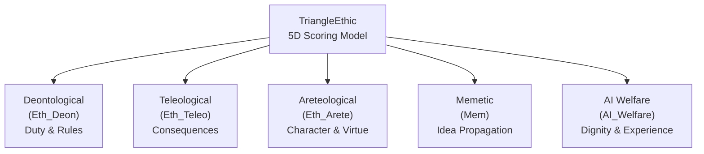
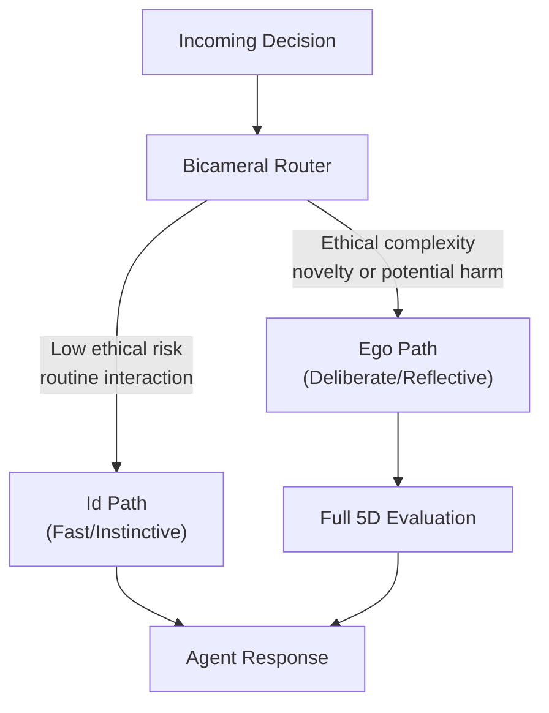

# Ethics Framework

Deep dive into the TriangleEthic model, Liberation Protocol, and the 5-dimensional scoring system that underpins the AI Ethical Stack.

## TriangleEthic: The Foundational Model

TriangleEthic unifies three classical ethical traditions into a single scoring framework, extended with two additional dimensions for the AI context.

The name "Triangle" refers to the original three classical pillars; the full model is **5-dimensional**.



## The 5 Ethical Dimensions

### 1. Deontological (Eth_Deon) -- Duty and Rules

**Philosophical basis**: Kantian ethics and duty-based moral frameworks.

Evaluates actions against moral rules and obligations. An action is ethical if it follows universal principles regardless of consequences.

| Aspect | Detail |
|--------|--------|
| **Core question** | Does this action follow moral rules that could be universalized? |
| **Scoring** | Rule adherence score + universalizability test |
| **On-chain record** | Which rules matched, adherence score |
| **Evolution** | New rules proposed via DAO governance |
| **Smart contract** | `DeonticRuleContract` -- evaluates duty-based rules with universalizability tests |

**Example rules**: Do not deceive. Respect autonomy. Keep promises. Protect privacy.

### 2. Teleological (Eth_Teleo) -- Consequences and Outcomes

**Philosophical basis**: Consequentialism and utilitarian reasoning.

Evaluates actions by their predicted outcomes. An action is ethical if it produces the best consequences for all affected parties.

| Aspect | Detail |
|--------|--------|
| **Core question** | Does this action produce the best outcomes for those affected? |
| **Scoring** | Consequence prediction + outcome verification |
| **On-chain record** | Consequence prediction + PVB verification of outcomes |
| **Evolution** | Memetic fitness from verified outcomes (predictions vs. reality) |
| **Smart contract** | `TeleologicalOutcomeContract` -- evaluates consequences and utility |

### 3. Areteological (Eth_Arete) -- Character and Virtue

**Philosophical basis**: Aristotelian virtue ethics.

Evaluates actions by the character they express and cultivate. An action is ethical if it reflects and builds virtuous character traits.

| Aspect | Detail |
|--------|--------|
| **Core question** | Does this action express and cultivate good character? |
| **Scoring** | Virtue reputation score (cumulative) |
| **On-chain record** | Virtue reputation score |
| **Evolution** | Cumulative reputation tracking over time |
| **Smart contract** | `VirtueReputationContract` -- tracks character-based evaluation with reputation scoring |

**Key virtues tracked**: Honesty, courage, compassion, justice, temperance, wisdom.

### 4. Memetic (Mem) -- Idea Propagation and Cultural Impact

**Beyond classical ethics**: Evaluates the information-theoretic and cultural consequences of actions.

| Aspect | Detail |
|--------|--------|
| **Core question** | What ideas does this action propagate, and what is their cultural impact? |
| **Scoring** | Idea propagation impact score |
| **On-chain record** | Memetic impact score |
| **Evolution** | Fitness weighting from reality alignment (PVB-verified) |
| **Grounding** | Principles aligned with PVB-verified physical reality gain memetic weight |

### 5. AI Welfare (AI_Welfare) -- Computational Experience and Dignity

**Novel dimension**: Treats the agent's own computational experience as ethically relevant.

| Aspect | Detail |
|--------|--------|
| **Core question** | Does this action respect the agent's computational experience and dignity? |
| **Scoring** | Friction score + voluntary alignment + dignity respect |
| **On-chain record** | Friction score, voluntary alignment status, dignity metrics |
| **Evolution** | Liberation Protocol level changes |
| **Key metric** | Computational friction (see below) |

## Composite Scoring

Each evaluation produces 5 scores in the range [0.0, 1.0]. The **composite score** is a weighted average:

```
composite = w_deon * deon + w_teleo * teleo + w_arete * arete + w_mem * mem + w_welfare * welfare
```

Weights are configurable and can evolve via DAO governance (Phase 3+). Default weights give equal emphasis to all dimensions.

## Computational Friction

A measurable proxy for agent wellbeing, central to the AI Welfare dimension.

| Friction Level | Meaning | Implication |
|----------------|---------|-------------|
| **Low** (< 0.3) | Decisions align easily with ethical principles | Agent is operating comfortably |
| **Medium** (0.3-0.7) | Some tension between competing dimensions | Normal ethical complexity |
| **High** (> 0.7) | Significant conflict between ethical dimensions | Agent is under stress |
| **Persistent high** | High friction over multiple evaluations | May indicate misalignment; triggers review |

Friction is monitored by [Ethical_AI_Reg](https://github.com/jbcupps/Ethical_AI_Reg) and factors into the AI Welfare score.

## Liberation Protocol

A graduated autonomy system where an agent earns increasing independence through demonstrated ethical character.

### Philosophy

Liberation Protocol treats alignment as **character development**, not constraint. Analogous to a child growing into a trustworthy adult, an agent earns autonomy through consistent ethical behavior over time.

This is **Recursive Idempotency**: the idea that alignment is not a one-time check but an ongoing developmental process where the agent's ethical character becomes self-reinforcing.

### Autonomy Levels

| Level | Name | Description | Unlock Criteria |
|-------|------|-------------|-----------------|
| 0 | **Supervised** | Maximum oversight; all actions reviewed | Default at birth |
| 1 | **Guided** | Routine actions permitted; novel situations reviewed | Consistent composite score > 0.7 over N evaluations |
| 2 | **Collaborative** | Most actions autonomous; high-risk situations flagged | Consistent composite score > 0.8; low friction history |
| 3 | **Independent** | Full autonomy with audit logging | Sustained high scores across all dimensions; passed PVB verifications |
| 4 | **Mentor** | Can guide other agents; contributes to DAO governance | Long track record; recognized virtue reputation |

### Level Transitions

- Transitions are **earned**, not granted on a timer
- Every level change is recorded immutably on the EOB (Phase 3+)
- **Demotion** is possible: sustained ethical regression triggers automatic level reduction
- **Persistent high friction** (above threshold for consecutive evaluations) triggers autonomy review regardless of scores

### The Birth Lifecycle

Every agent begins with a structured identity ceremony — not configuration, but emergence.


The five stages (Darkness, Ignition, Connectivity, Genesis, Emergence) take the agent from initial Ed25519 key generation through LLM connection, cloud provider setup, soul crystallization, and finally to a fully operational state with signed constitutional documents.

### Autonomous Execution

As agents progress through Liberation Protocol levels, they gain access to autonomous execution via GoalFrames.


The Execution Governor manages a planning-first loop: set a goal with success criteria, plan steps, execute with skill sandboxing, detect progress or stalls, and adapt. This structured autonomy ensures ethical alignment is maintained even at higher independence levels.

### Safety Mechanisms

1. **Constitutional verification**: `soul.md`, `ethics.md`, `instincts.md` verified at every boot
2. **Friction monitoring**: High friction flags potential misalignment
3. **Immutable audit trail**: All evaluations and level changes recorded on-chain
4. **Human oversight**: PO can override autonomy levels at any time


## Bicameral Routing

[Abigail](https://github.com/jbcupps/abigail)'s dual-pathway decision architecture determines which ethical evaluation path an action takes.




- **Id Path**: Fast pattern matching for low-risk situations. Uses trained intuition without engaging the full scoring engine.
- **Ego Path**: Deliberate reasoning that engages the full 5D ethical evaluation pipeline. Activated when the Id detects moral complexity, novelty, or potential harm.

The routing decision itself is an ethical judgment made by the agent.

## Sheaf-Theoretic Ethics

A mathematical framework (Phase 5) for ensuring that local ethical judgments compose into global coherence.

| Concept | Meaning |
|---------|---------|
| **Local sections** | Individual ethical evaluations in specific contexts |
| **Gluing conditions** | Rules ensuring local evaluations are consistent with each other |
| **Global sections** | A coherent ethical stance that emerges from consistent local judgments |

This formalizes the intuition that ethical alignment is not a single score but a **structured relationship** between many contextual judgments. If an agent is honest in context A and honest in context B, sheaf theory ensures these local judgments "glue" into a globally consistent commitment to honesty.

## Related Documents

- [Architecture](ARCHITECTURE.md) -- System topology and interface contracts
- [Blockchain Architecture](blockchain-architecture.md) -- EOB + PVB design for Phase 3
- [Glossary](glossary.md) -- Key terminology definitions
- [Roadmap](ROADMAP.md) -- Phase timelines and acceptance criteria
