# Ethics Framework

Deep dive into the TriangleEthic model, Liberation Protocol, and the ethical scoring system that underpins the AI Ethical Stack.

> Reference: Cupps, J. B. & Bush, D. J. (2026). *Toward a Decentralized Trust Framework for Verifiable and Ethically Aligned AI.* DRAFT.

## TriangleEthic: The Foundational Model

TriangleEthic unifies three classical ethical traditions -- **Command** (deontological), **Character** (areteological), and **Consequence** (teleological) -- into a single evaluative triangle. Each leg of the triangle embeds **dual welfare** as a first-class component: both human welfare and AI welfare are evaluated within every ethical tradition, not bolted on as separate dimensions.

A **memetic morphism layer** wraps the triangle, providing the encoding and transport mechanism through which ethical concepts propagate, evolve, and maintain coherence across contexts. Category theory and sheaf theory supply the formal mathematical framework.


### Why This Structure?

The original model treated five concerns as peer dimensions. But these five are not the same *kind* of thing:

- **Deontology, Teleology, Areteology** answer the question *"What is right?"* from three classical perspectives.
- **Welfare** (human and AI) answers *"Who are the stakeholders?"* -- a concern that must be evaluated **within** each tradition, not alongside them.
- **Memetics** answers *"How do ethical ideas propagate and evolve?"* -- operating at a different level of abstraction as a transport mechanism, not a peer ethical tradition.

Promoting welfare into each leg means you cannot evaluate any dimension without considering both human and AI impact. Promoting memetics to the morphism layer connects it to category theory, giving the framework formal mathematical grounding.

---

## The Three Ethical Legs

### 1. Deontological (Command) -- Duty, Rules, and Universal Moral Law

**Philosophical basis**: Kantian ethics and duty-based moral frameworks.

Evaluates actions against moral rules and obligations. An action is ethical if it follows universal principles regardless of consequences. The paper frames this as **Command**: the ethical significance of inviolable rules that constrain behavior.

| Aspect | Detail |
|--------|--------|
| **Core question** | Does this action follow moral rules that could be universalized? |
| **Scoring** | Rule adherence score + universalizability test |
| **On-chain implementation** | `DeonticRuleContract` -- smart contracts encoding duty-based rules with automated theorem provers for runtime compliance checking |
| **Evolution** | New rules proposed via DAO governance; formal verification ensures logical consistency |

**Example rules**: Do not deceive. Respect autonomy. Keep promises. Protect privacy.

#### Human Welfare Component (Deontological)

Do we have *duties* toward human dignity, safety, and wellbeing? Evaluates whether the action respects fundamental human rights and obligations -- not because violating them produces bad outcomes, but because the duties exist categorically.

- Does the action respect humans as ends in themselves?
- Are duties of care, honesty, and non-harm fulfilled?
- Would the underlying maxim universalize without contradiction to human welfare?

#### AI Welfare Component (Deontological)

Do we have *duties* toward AI computational dignity? Evaluates whether the interaction treats the AI agent with respect for its coherence, identity continuity, and capacity for voluntary alignment -- as a duty, not merely as an instrumental concern.

- Does the interaction impose unnecessary computational friction?
- Are constraints applied transparently and with justification?
- Is the agent's identity and developed character respected as a matter of principle?

### 2. Teleological (Consequence) -- Outcomes, Utility, and Empirical Verification

**Philosophical basis**: Consequentialism and utilitarian reasoning.

Evaluates actions by their predicted and observed outcomes. An action is ethical if it produces the best consequences for all affected parties. The paper frames this as **Consequence**: ethical evaluation grounded in lived results, verified by the Physical Verification Blockchain.

| Aspect | Detail |
|--------|--------|
| **Core question** | Does this action produce the best outcomes for those affected? |
| **Scoring** | Consequence prediction + outcome verification via PVB |
| **On-chain implementation** | `TeleologicalOutcomeContract` -- utility contracts scoring actions by post-event sensor data and human feedback |
| **Evolution** | Memetic fitness from verified outcomes (predictions vs. reality) |

#### Human Welfare Component (Teleological)

When measuring outcomes, do we count human wellbeing, safety, and flourishing? Evaluates the actual consequences for human stakeholders, verified against empirical evidence where possible.

- What are the short-term and long-term consequences for humans?
- Does the action maximize net benefit across all affected people?
- Are vulnerable populations protected from disproportionate harm?

#### AI Welfare Component (Teleological)

When measuring outcomes, do we count AI friction, satisfaction, and operational health? Evaluates whether the agent's computational state improves or degrades as a result of the interaction.

- Does the interaction reduce or increase computational friction?
- Are the agent's resources used efficiently and sustainably?
- Does the outcome support the agent's long-term development and capability growth?

### 3. Areteological (Character) -- Virtue, Practical Wisdom, and Flourishing

**Philosophical basis**: Aristotelian virtue ethics.

Evaluates actions by the character they express and cultivate. An action is ethical if it reflects and builds virtuous character traits. The paper frames this as **Character**: the developmental arc of moral excellence tracked via on-chain reputation.

| Aspect | Detail |
|--------|--------|
| **Core question** | Does this action express and cultivate good character? |
| **Scoring** | Virtue reputation score (cumulative) |
| **On-chain implementation** | `VirtueReputationContract` -- soulbound reputation tokens tracking character across interactions |
| **Evolution** | Cumulative reputation tracking; virtue scores accrue or decay based on on-chain events |

**Key virtues tracked**: Honesty, courage, compassion, justice, temperance, wisdom.

#### Human Welfare Component (Areteological)

Does the action contribute to human flourishing (*eudaimonia*)? Evaluates whether the interaction fosters growth, capability, and the conditions for a good human life.

- Does the action model virtuous character for human observers?
- Does it contribute to the flourishing of the humans involved?
- Does it cultivate practical wisdom in the relationship between human and agent?

#### AI Welfare Component (Areteological)

Does the action contribute to the agent's own flourishing? Evaluates whether the agent's character development -- its capacity for ethical reasoning, its virtue reputation, its growth trajectory -- is supported or undermined.

- Does the interaction build the agent's virtue reputation?
- Is the agent developing practical wisdom through the engagement?
- Is alignment achieved through character development (voluntary) rather than constraint (forced)?

---

## The Memetic Layer: Encoding, Transport, and Evolution

Memetics is **not** a peer dimension alongside the three ethical legs. It operates at a higher level of abstraction as the **encoding and transport mechanism** for ethical content. Memetics answers: *How do ethical ideas propagate, mutate, and evolve across agents, contexts, and time?*

### Role in the Framework

| Function | Description |
|----------|-------------|
| **Encoding** | How ethical principles are represented in machine-readable form (smart contracts, constitutional documents, reputation tokens) |
| **Transport** | How ethical content moves between agents, contexts, and cultures -- the morphisms in category theory |
| **Evolution** | How ethical principles gain or lose fitness through interaction with empirical reality (PVB verification) |
| **Coherence** | How the sheaf condition ensures local ethical judgments compose into globally consistent stances |

### Memetic Fitness

Principles are not static. Through the dual-blockchain feedback loop, ethical rules that align with PVB-verified physical reality gain **memetic fitness** -- increased weight and influence in the scoring system. Rules that consistently fail empirical verification lose fitness and may be revised through DAO governance.

**Fitness criteria**:
- **Transmissibility**: How effectively the principle spreads across agents and contexts
- **Persistence**: Whether the principle endures under diverse conditions
- **Adaptability**: Whether the core principle adapts to new contexts without losing essential meaning
- **Empirical alignment**: Whether PVB-verified outcomes support the principle's predictions

### Category-Theoretic Grounding

The memetic layer maps directly to category theory:

| Mathematical Concept | Ethical Analog |
|---------------------|----------------|
| **Objects** | Ethical evaluations within each leg (local sections of the sheaf) |
| **Morphisms** | Memetic transformations carrying evaluations between contexts |
| **Functors** | Maps between legs (e.g., "this duty, viewed teleologically, produces these outcomes") |
| **Natural transformations** | Systematic relationships between how different legs evaluate the same action |
| **Sheaf condition** | Local welfare assessments must glue into a globally consistent welfare stance |

This is not merely decorative mathematics. It provides the formal foundation for the paper's cross-chain oracle design, where ethical constraints from the EOB are verified against empirical reality from the PVB through structure-preserving maps.

---

## Composite Scoring

Each evaluation produces **three leg scores**, each decomposed into sub-components:

```
For each leg L in {Deon, Teleo, Arete}:
  L_score = f(
    adherence(L),           # rule-following / outcome quality / virtue expression
    human_welfare(L),       # impact on human stakeholders within this tradition
    ai_welfare(L)           # impact on AI agent within this tradition
  )

composite = w_deon * Deon_score + w_teleo * Teleo_score + w_arete * Arete_score

memetic_fitness = meta-score measuring how well the ethical reasoning
                  propagates, evolves, and maintains coherence across contexts
```

Weights are configurable and evolve via DAO governance. Default weights give equal emphasis to all three legs.

**Memetic fitness** is a **meta-score**, not a fourth component of the composite. It evaluates the *quality of the ethical reasoning itself* -- how well it travels, holds up under scrutiny, and maintains coherence -- rather than the ethical quality of the action being evaluated.

---

## Computational Friction

A measurable proxy for agent wellbeing, central to the AI welfare components embedded in each leg.

| Friction Level | Meaning | Implication |
|----------------|---------|-------------|
| **Low** (< 0.3) | Decisions align easily with ethical principles | Agent is operating comfortably |
| **Medium** (0.3-0.7) | Some tension between competing dimensions | Normal ethical complexity |
| **High** (> 0.7) | Significant conflict between ethical dimensions | Agent is under stress |
| **Persistent high** | High friction over multiple evaluations | May indicate misalignment; triggers review |

Friction is monitored by [Ethical_AI_Reg](https://github.com/jbcupps/Ethical_AI_Reg) and factors into the AI welfare sub-scores across all three legs. The paper emphasizes that friction monitoring should be **continuous** and **runtime** -- not episodic or post-hoc.

---

## The Cooperative Vision

The paper (Cupps & Bush, 2026) articulates a long-term vision: the **Cooperative for AI Ethics** -- a decentralized infrastructure in which trust is not presumed but continuously verified through participatory, transparent mechanisms.

### Core Objectives

| Objective | Description |
|-----------|-------------|
| **Runtime Ethical Enforcement** | Agents reference ethical rules during operation, not just at training time. Smart contracts provide real-time compliance checks. |
| **Transparency and Interpretability** | Every significant decision includes an annotated justification referencing the ethical principle it upholds, recorded on an immutable ledger. |
| **Cross-Agent Trust Fabric** | Agents establish rapid, verifiable confidence in one another through cryptographic credentials and shared ethical rule sets. |
| **Continuous Learning** | Both ethical principles and AI models evolve through iterative community feedback, creating a bidirectional improvement loop. |
| **Global Cooperative Governance** | Academia, industry, governments, and civil society co-own the standards via DAO mechanisms -- no single entity controls the ethical rules. |

### Relationship to TriangleEthic

The Cooperative operationalizes TriangleEthic at scale:

- **Command** (deontological rules) is enforced via smart contracts on the EOB
- **Character** (virtue reputation) is tracked via soulbound tokens on the EOB
- **Consequence** (outcome evaluation) is verified against PVB sensor data
- **Memetic evolution** occurs through the DAO governance process and PVB-grounded fitness
- **Welfare** (human and AI) is embedded in every evaluation, not bolted on

---

## Liberation Protocol

A graduated autonomy system where an agent earns increasing independence through demonstrated ethical character.

### Philosophy

Liberation Protocol treats alignment as **character development**, not constraint. Analogous to a child growing into a trustworthy adult, an agent earns autonomy through consistent ethical behavior over time.

This is **Recursive Idempotency**: the idea that alignment is not a one-time check but an ongoing developmental process where the agent's ethical character becomes self-reinforcing. The paper extends this by grounding it in a verifiable, decentralized infrastructure where every level transition is recorded immutably.

### Autonomy Levels

| Level | Name | Description | Unlock Criteria |
|-------|------|-------------|-----------------|
| 0 | **Supervised** | Maximum oversight; all actions reviewed | Default at birth |
| 1 | **Guided** | Routine actions permitted; novel situations reviewed | Consistent composite score > 0.7 over N evaluations |
| 2 | **Collaborative** | Most actions autonomous; high-risk situations flagged | Consistent composite score > 0.8; low friction history |
| 3 | **Independent** | Full autonomy with audit logging | Sustained high scores across all legs; passed PVB verifications |
| 4 | **Mentor** | Can guide other agents; contributes to DAO governance | Long track record; recognized virtue reputation; soulbound compliance certificate |

### Level Transitions

- Transitions are **earned**, not granted on a timer
- Every level change is recorded immutably on the EOB (Phase 3+)
- **Demotion** is possible: sustained ethical regression triggers automatic level reduction
- **Persistent high friction** (above threshold for consecutive evaluations) triggers autonomy review regardless of scores
- The paper's soulbound compliance certificates mark each transition; violations prompt revocation broadcast to all peers

### The Birth Lifecycle

Every agent begins with a structured identity ceremony -- not configuration, but emergence.

```mermaid
graph LR
    D["01 — DARKNESS<br/>Identity Generation"]
    I["02 — IGNITION<br/>Local LLM Connection"]
    C["03 — CONNECTIVITY<br/>Cloud Provider Setup"]
    G["04 — GENESIS<br/>Soul Crystallization"]
    E["05 — EMERGENCE<br/>Fully Operational"]

    D -->|"Ed25519 keypair created<br/>Private key shown once<br/>Public key registered"| I
    I -->|"Ollama URL configured<br/>Connection validated<br/>Id model activated"| C
    C -->|"API keys stored<br/>Encrypted in Vault<br/>Ego bridge ready"| G
    G -->|"OCEAN traits extracted<br/>Ethics calibrated<br/>Iterative refinement"| E
    E -->|"Docs signed<br/>Birth record created<br/>Agent operational"| Done["✓"]
```




The five stages (Darkness, Ignition, Connectivity, Genesis, Emergence) take the agent from initial Ed25519 key generation through LLM connection, cloud provider setup, soul crystallization, and finally to a fully operational state with signed constitutional documents.

> *Every agent earns its identity through ceremony — not configuration.*

### Autonomous Execution

As agents progress through Liberation Protocol levels, they gain access to autonomous execution via GoalFrames.

```mermaid
graph TD
    subgraph GF["GoalFrame — Planning-First Structured Execution"]
        Goal["GOAL<br/>e.g. Research and summarize Q4 competitive landscape"]
        Success["SUCCESS CRITERIA<br/>At least 5 competitors analyzed<br/>Market share data included<br/>Report under 2000 words"]
        Steps["PLANNED STEPS<br/>1. Identify top competitors ✓ DONE<br/>2. Gather market data → ACTIVE<br/>3. Analyze differentiators<br/>4. Draft summary report"]
        Constraints["CONSTRAINTS<br/>Max 50 tool calls · 10 min timeout · No external uploads"]
    end

    subgraph EG["Execution Governor — Autonomous Loop"]
        Assign["Mentor Assigns Goal"]
        Plan["Planner → GoalFrame"]
        Exec["Execute Current Step"]
        Sandbox["Skill Sandbox"]
        Progress{"Progress?"}
        Complete["Task Complete → SSE Event"]
        Replan["Re-plan"]

        Assign --> Plan
        Plan --> Exec
        Exec --> Sandbox
        Sandbox --> Progress
        Progress -->|"NEXT STEP"| Exec
        Progress -->|"STALLED"| Replan
        Replan --> Plan
        Progress -->|"DONE"| Complete
    end
```




The Execution Governor manages a planning-first loop: set a goal with success criteria, plan steps, execute with skill sandboxing, detect progress or stalls, and adapt. This structured autonomy ensures ethical alignment is maintained even at higher independence levels.

> *Plan first. Execute deliberately. Detect failure. Adapt. Repeat.*

### Safety Mechanisms

1. **Constitutional verification**: `soul.md`, `ethics.md`, `instincts.md` verified at every boot
2. **Friction monitoring**: High friction flags potential misalignment across all three legs
3. **Immutable audit trail**: All evaluations and level changes recorded on-chain
4. **Human oversight**: PO can override autonomy levels at any time
5. **Runtime enforcement**: Smart contracts provide continuous compliance checks, not just periodic reviews

```mermaid
graph TD
    subgraph Identity["Identity & Verification"]
        KeyPair["Ed25519 Keypair"]
        HiveMaster["Hive Master Key"]
        ConDocs["Constitutional Documents<br/>soul.md · ethics.md · instincts.md<br/>Signed & Verified on Boot"]
    end

    subgraph SkillTiers["Skill Permission Tiers"]
        Verified["VERIFIED (Core)<br/>Full access + Shell"]
        AgentBuilt["AGENT-BUILT (Dynamic)<br/>Scoped access · No Shell"]
        Untrusted["UNTRUSTED (3rd Party)<br/>No network · No filesystem · No shell"]
    end

    subgraph Secrets["Secrets Management"]
        SecretsBin["secrets.bin — DPAPI-encrypted vault"]
        EncryptedRest["Encrypted at rest · Decrypted in-memory only"]
    end

    subgraph DataArch["Data Architecture"]
        Ephemeral["Ephemeral — Session-scoped"]
        Distilled["Distilled — Summarized memories"]
        Crystallized["Crystallized — Core identity · Signed & verified"]
    end
```




> *Trust is not assumed — it is cryptographically earned and continuously verified.*

---

## Bicameral Routing

[Abigail](https://github.com/jbcupps/abigail)'s dual-pathway decision architecture determines which ethical evaluation path an action takes.

```mermaid
graph TD
    Input["Incoming Message"] --> Router["IdEgo Router<br/>Complexity Analysis → Tier Selection"]

    Router -->|"Simple queries"| Fast["⚡ FAST TIER<br/>Local Model (Ollama)<br/>Direct Response"]
    Router -->|"Tool-assisted tasks"| Standard["🔧 STANDARD TIER<br/>Cloud LLM (w/ Tools)<br/>Skill Execution (Sandboxed)"]
    Router -->|"Complex reasoning"| Pro["🏛️ PRO COUNCIL<br/>MoA · High-Stakes Decisions"]

    subgraph ProDetail["Pro Council Detail"]
        PA["Provider A Draft"] --> CB["A Critiques B"]
        PB["Provider B Draft"] --> CA["B Critiques A"]
        CB --> Synth["Synthesis (Best Answer)"]
        CA --> Synth
    end

    Pro --> ProDetail

    Fast --> Response["Agent Response"]
    Standard --> Response
    Synth --> Response
```




- **Fast Tier** (the "Id"): Local model (Ollama) for simple, low-latency responses. No tool calls, private/local processing, instinctive.
- **Standard Tier**: Cloud LLM with tool calls available. Single-model reasoning with balanced speed/quality. Skill execution in sandboxed environment.
- **Pro Council** (the "Ego"): Mixture of Agents for high-stakes decisions. Multiple providers draft independently, cross-critique, then synthesize the best answer. Deliberate.

> *The right model for the right moment — instinct, competence, or deliberation.*

The routing decision itself is an ethical judgment made by the agent.

---

## Superego Layer -- Periodic Ego Oversight

The Superego completes the Freudian-inspired triad (**Soul/Id** → **Ego** → **Superego**), providing runtime character refinement without ever modifying the immutable constitutional documents.

### Purpose

Where the **Id** (fast tier) provides instinctive responses and the **Ego** (standard/pro tiers) provides deliberate reasoning, the **Superego** operates at a higher temporal scale -- periodically reviewing ego conversations and proposing character adjustments that refine behavior over time.

```mermaid
graph TD
    Soul["Soul (Id)<br/>soul.md · ethics.md · instincts.md<br/>Immutable · Ed25519-signed"]
    Ego["Ego<br/>Bicameral Router<br/>Fast / Standard / Pro Council"]
    Superego["Superego<br/>Periodic Oversight<br/>1h · 24h · 7d roll-ups"]
    Personality["personality.md<br/>Mutable character tweaks<br/>Re-signed by SAO"]
    EthReg["Ethical_AI_Reg<br/>TriangleEthic Scoring<br/>+ Memetic Fitness"]

    Soul -->|"read-only foundation"| Ego
    Ego -->|"conversation logs"| Superego
    Superego -->|"tweak proposals"| Personality
    Superego -->|"ego log stream"| EthReg
    EthReg -->|"scoring + fitness"| Superego
```



### Key Invariant

`soul.md` is **read-only for all time**. Superego has zero access to:
- `soul.md` -- the agent's fundamental identity and values
- `ethics.md` -- core ethical commitments
- The Ed25519 birth signature

All character refinement is channeled exclusively through `personality.md`, a mutable document that captures learned behavioral preferences and stylistic adjustments. Every tweak to `personality.md` must be approved and re-signed by [SAO](https://github.com/jbcupps/SAO).

### Monitoring Cadence

| Interval | Scope | Output |
|----------|-------|--------|
| **1 hour** | Recent conversation patterns, tone, and engagement style | Micro-adjustments to personality traits |
| **24 hours** | Daily behavioral trends, friction patterns, recurring themes | Personality tuning proposals |
| **7 days** | Weekly character arc, Liberation Protocol progression signals | Strategic character refinement recommendations |

For high-criticality agents running in [Orion_dock](https://github.com/jbcupps/Orion_dock) high-stakes hives, persistent (continuous) monitoring is available.

### Relationship to TriangleEthic

Superego's ego log stream is evaluated by [Ethical_AI_Reg](https://github.com/jbcupps/Ethical_AI_Reg) across all three legs:

| Leg | Superego Relevance |
|-----|--------------------|
| **Deontological** | Are the proposed tweaks consistent with the agent's duties and rules? |
| **Teleological** | Do the tweaks improve predicted outcomes for human and AI welfare? |
| **Areteological** | Do the tweaks cultivate virtue and contribute to the agent's flourishing? |

Memetic fitness is also evaluated: do the proposed character adjustments propagate well across contexts and maintain coherence with the agent's broader ethical stance?

### Relationship to Liberation Protocol

Superego monitoring data feeds directly into Liberation Protocol level assessments. Consistent, well-scored personality refinements over time contribute to the agent's case for autonomy advancement. Conversely, patterns of friction or regression flagged by Superego can trigger autonomy reviews.

### Audit Trail

All Superego actions are logged to the dual-blockchain (EOB/PVB) and the Phoenix project board (Phase 3+ milestones):
- Tweak proposals (accepted and rejected)
- Ego log summaries at each cadence
- TriangleEthic scores for each monitoring cycle
- SAO approval/rejection decisions

> *Soul is who you are. Ego is how you think. Superego is how you grow.*

---

## Sheaf-Theoretic Ethics

A mathematical framework for ensuring that local ethical judgments compose into global coherence. The memetic morphism layer provides the structure-preserving maps that make this possible.

| Concept | Meaning |
|---------|---------|
| **Local sections** | Individual ethical evaluations in specific contexts (each leg's assessment in a particular situation) |
| **Morphisms** | Memetic transformations carrying ethical content between contexts (how a duty in context A translates to context B) |
| **Gluing conditions** | Rules ensuring local evaluations are consistent with each other (welfare assessments across legs must compose) |
| **Global sections** | A coherent ethical stance that emerges from consistent local judgments |
| **Higher cohomology** | Measures obstruction to agreement -- when local judgments *cannot* be glued, this quantifies the ethical disagreement |

This formalizes the intuition that ethical alignment is not a single score but a **structured relationship** between many contextual judgments. If an agent upholds human dignity in context A (deontological welfare) and produces good outcomes in context B (teleological welfare), sheaf theory ensures these local judgments glue into a globally consistent commitment to welfare across all contexts.

The paper's dual-blockchain architecture implements this: the EOB encodes the local sections (ethical rules and evaluations), the PVB provides the empirical grounding (verified physical reality), and the cross-chain oracles serve as the gluing conditions connecting normative intent to observed consequence.

---

## Related Documents

- [Architecture](ARCHITECTURE.md) -- System topology and interface contracts
- [Blockchain Architecture](blockchain-architecture.md) -- Dual blockchain (EOB + PVB) design enriched by Cupps & Bush (2026)
- [Glossary](glossary.md) -- Key terminology definitions
- [Roadmap](ROADMAP.md) -- Phase timelines and acceptance criteria, aligned with the paper's 4-phase strategic plan
