# Integration Guide

How [Abigail](https://github.com/jbcupps/abigail), [SAO](https://github.com/jbcupps/SAO), [Ethical_AI_Reg](https://github.com/jbcupps/Ethical_AI_Reg), and [Orion_dock](https://github.com/jbcupps/Orion_dock) communicate within the AI Ethical Stack.

## Overview


All inter-service communication is authenticated via **Ed25519 signatures**. No service trusts another without cryptographic verification.


## Connection Models

### Abigail <-> SAO (Optional)

[Abigail](https://github.com/jbcupps/abigail) is designed as a **standalone-first** agent. SAO connection is optional and enhances capabilities without being required.

**Standalone mode** (no SAO):
- Full local ethical evaluation using built-in heuristics
- Constitutional document verification at boot
- Local SQLite persistence for all agent state
- No external network calls required

**Connected mode** (with SAO):
- Multi-agent identity management
- Centralized ethical evaluation via [Ethical_AI_Reg](https://github.com/jbcupps/Ethical_AI_Reg)
- Cross-agent data sharing and coordination
- Audit logging in PostgreSQL

### Connection Establishment


### Authentication Header Format

Every request from Abigail to SAO includes:

```
X-Agent-Id: <agent_uuid>
X-Agent-Signature: <ed25519_signature_of_request_body>
X-Agent-Timestamp: <unix_timestamp>
```

SAO verifies the signature using the agent's registered public key and rejects requests with timestamps older than 5 minutes (replay protection).

## SAO <-> Ethical_AI_Reg

[SAO](https://github.com/jbcupps/SAO) forwards ethical evaluation requests to [Ethical_AI_Reg](https://github.com/jbcupps/Ethical_AI_Reg) and returns the 5D scores to the requesting agent.

### Evaluation Flow

1. Agent sends action payload to SAO
2. SAO validates agent identity (Ed25519)
3. SAO forwards to Ethical_AI_Reg `/api/v1/evaluate`
4. Ethical_AI_Reg runs the 5D scoring engine
5. Scores returned: `{deon, teleo, arete, mem, welfare}`
6. SAO logs the evaluation and returns scores to agent

### Request Format

```json
POST /api/v1/evaluate
{
  "agent_id": "uuid",
  "action": {
    "type": "response | decision | interaction",
    "content": "description of the action",
    "context": "surrounding context"
  },
  "metadata": {
    "timestamp": "ISO 8601",
    "session_id": "uuid"
  }
}
```

### Response Format

```json
{
  "evaluation_id": "uuid",
  "scores": {
    "deon": 0.85,
    "teleo": 0.72,
    "arete": 0.91,
    "mem": 0.68,
    "welfare": 0.88
  },
  "composite_score": 0.808,
  "friction": 0.15,
  "alignment_summary": "Action aligns well with duty and virtue dimensions; memetic impact needs monitoring.",
  "timestamp": "ISO 8601"
}
```

## Orion_dock Integration

[Orion_dock](https://github.com/jbcupps/Orion_dock) provides the containerized runtime environment for deploying stack components.

### Role in the Stack

| Function | Detail |
|----------|--------|
| **Container Orchestration** | Docker Compose definitions for SAO, Ethical_AI_Reg, and supporting services |
| **Network Management** | Docker bridge network isolating stack traffic from host |
| **Volume Management** | Persistent volumes for PostgreSQL data, SQLite databases, and constitutional documents |
| **Service Discovery** | Internal DNS for inter-container communication |
| **Build Pipelines** | Multi-stage Dockerfiles for Rust (SAO) and Python (Ethical_AI_Reg) builds |
| **Health Monitoring** | Container health checks and restart policies |

### Service Architecture

```mermaid
graph TD
    subgraph "Orion_dock Docker Network"
        SAO_C["SAO Container<br/>(Rust/Axum)"]
        ETH_C["Ethical_AI_Reg Container<br/>(Flask/React)"]
        PG["PostgreSQL Container"]
        SAO_C --> PG
        SAO_C --> ETH_C
    end

    Abigail["Abigail Desktop<br/>(runs on host)"] -- "Host network → Docker bridge" --> SAO_C
```



### Configuration

Orion_dock uses environment variables for service configuration:

| Variable | Service | Purpose |
|----------|---------|---------|
| `SAO_PORT` | SAO | HTTP/WS listen port (default: 8080) |
| `SAO_DB_URL` | SAO | PostgreSQL connection string |
| `ETH_REG_PORT` | Ethical_AI_Reg | Flask listen port (default: 5000) |
| `ETH_REG_DB_URL` | Ethical_AI_Reg | Database connection string |
| `POSTGRES_PASSWORD` | PostgreSQL | Database password (from Docker secrets) |

### Deployment

```bash
# Clone Orion_dock
git clone https://github.com/jbcupps/Orion_dock.git
cd Orion_dock

# Start the stack
docker compose up -d

# Verify services
docker compose ps
docker compose logs -f sao
```

## Phoenix Coordination Role

[Phoenix](https://github.com/jbcupps/Phoenix) does not participate in runtime communication. Its integration role is:

1. **Documentation hub**: Canonical architecture, interface contracts, and integration guides (this document)
2. **Project tracking**: [GitHub Project board](https://github.com/users/jbcupps/projects/3) coordinates cross-repo issues
3. **Standards enforcement**: Naming conventions, commit conventions, and security boundaries defined in [CLAUDE.md](../CLAUDE.md)
4. **Phase gating**: Build phase transitions require all repos to meet acceptance criteria defined in the [Roadmap](ROADMAP.md)

## The Trust Chain


The trust chain flows from the Enterprise Identity Provider through SAO's vault and master key signing down to each agent's Ed25519 identity. Every action is traceable: Agent -> Master Key -> Admin -> IDP -> Employee.

## SAO Dashboard


The SAO dashboard provides real-time visibility into vault status, registered agents, stored secrets, and a full audit log of all agent and admin actions.

## Security Boundaries

| Boundary | Enforcement |
|----------|------------|
| API keys never leave SecretsVault in plaintext | DPAPI encryption at rest, Ed25519 for transit |
| All inter-service calls are authenticated | Ed25519 signature on every request |
| Constitutional documents are tamper-proof | Cryptographic signing and boot-time verification |
| SAO rejects unregistered agents | Public key must be in identity registry |
| Replay attacks prevented | Timestamp validation on signed requests |
