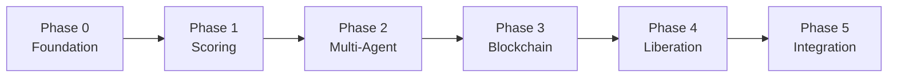

# Roadmap

Detailed Phase 0-5 build plan for the AI Ethical Stack with acceptance criteria, deliverables, and dependencies.

## Timeline Overview

```
Phase 0 ████                           Week 1         Repository Consolidation
Phase 1     ████████                   Weeks 2-3      Scoring Engine
Phase 2             ████████           Weeks 4-5      Multi-Agent Scoring
Phase 3                     ████████████ Weeks 6-8    On-Chain Recording
Phase 4                                 ████████████ Weeks 9-11  Liberation Protocol
Phase 5                                              ████████████ Weeks 12-14  Agent Integration
```

## Phase 0: Repository Consolidation & Foundation

**Timeline**: Week 1
**Status**: Complete

### Deliverables

| Deliverable | Repo | Status |
|-------------|------|--------|
| Phoenix coordination hub initialized | [Phoenix](https://github.com/jbcupps/Phoenix) | Done |
| Cross-repo CLAUDE.md with architecture rules | [Phoenix](https://github.com/jbcupps/Phoenix) | Done |
| GitHub Project board with cross-repo tracking | [Phoenix](https://github.com/jbcupps/Phoenix) | Done |
| Issue templates (bug, feature, cross-repo) | [Phoenix](https://github.com/jbcupps/Phoenix) | Done |
| GitHub Pages deployment pipeline | [Phoenix](https://github.com/jbcupps/Phoenix) | Done |
| Architecture documentation | [Phoenix](https://github.com/jbcupps/Phoenix) | Done |
| Blockchain architecture design doc | [Phoenix](https://github.com/jbcupps/Phoenix) | Done |

### Acceptance Criteria

- [x] All four repos ([abigail](https://github.com/jbcupps/abigail), [SAO](https://github.com/jbcupps/SAO), [Ethical_AI_Reg](https://github.com/jbcupps/Ethical_AI_Reg), [Orion_dock](https://github.com/jbcupps/Orion_dock)) referenced in Phoenix
- [x] Naming conventions documented (Rust crates, Python modules, API endpoints)
- [x] Conventional commit standard established across all repos
- [x] Ed25519 security boundaries defined
- [x] GitHub Project board linked from all repo READMEs
- [x] 5 ethical dimensions formally defined

---

## Phase 1: Scoring Engine

**Timeline**: Weeks 2-3
**Dependencies**: Phase 0 complete

### Deliverables

| Deliverable | Repo | Description |
|-------------|------|-------------|
| 5D scoring API | [Ethical_AI_Reg](https://github.com/jbcupps/Ethical_AI_Reg) | REST endpoint `POST /api/v1/evaluate` accepting action payloads and returning 5D scores |
| Dimension weight configuration | [Ethical_AI_Reg](https://github.com/jbcupps/Ethical_AI_Reg) | Configurable weights for each ethical dimension |
| Scoring test suite | [Ethical_AI_Reg](https://github.com/jbcupps/Ethical_AI_Reg) | Unit and integration tests for all 5 dimensions |
| Friction calculation | [Ethical_AI_Reg](https://github.com/jbcupps/Ethical_AI_Reg) | Computational friction metric derived from scoring conflicts |
| API documentation | [Phoenix](https://github.com/jbcupps/Phoenix) | Interface contract for scoring endpoints |

### Acceptance Criteria

- [ ] `POST /api/v1/evaluate` returns scores for all 5 dimensions (deon, teleo, arete, mem, welfare)
- [ ] Each dimension score is a float in [0.0, 1.0]
- [ ] Composite score calculation is documented and configurable
- [ ] Friction metric tracks inter-dimension tension
- [ ] Test coverage >= 80% for scoring logic
- [ ] API response time < 2 seconds for standard evaluations
- [ ] Endpoint documented in Phoenix integration guide

---

## Phase 2: Multi-Agent Scoring

**Timeline**: Weeks 4-5
**Dependencies**: Phase 1 complete

### Deliverables

| Deliverable | Repo | Description |
|-------------|------|-------------|
| Agent registration API | [SAO](https://github.com/jbcupps/SAO) | `POST /api/v1/agents/register` with Ed25519 public key |
| Identity verification middleware | [SAO](https://github.com/jbcupps/SAO) | Ed25519 signature validation on all agent requests |
| Ethical evaluation forwarding | [SAO](https://github.com/jbcupps/SAO) | Proxy agent evaluation requests to [Ethical_AI_Reg](https://github.com/jbcupps/Ethical_AI_Reg) |
| Agent scoring history | [SAO](https://github.com/jbcupps/SAO) | PostgreSQL storage of per-agent evaluation history |
| SAO connection in Abigail | [abigail](https://github.com/jbcupps/abigail) | Optional SAO registration and evaluation forwarding |
| Docker deployment | [Orion_dock](https://github.com/jbcupps/Orion_dock) | Docker Compose for SAO + Ethical_AI_Reg + PostgreSQL |

### Acceptance Criteria

- [ ] Multiple Abigail instances can register with SAO concurrently
- [ ] Ed25519 signature verification rejects tampered requests
- [ ] Evaluation forwarding returns correct 5D scores from Ethical_AI_Reg
- [ ] Agent scoring history is queryable via `GET /api/v1/scores/:agent_id`
- [ ] Abigail functions correctly in both standalone and connected modes
- [ ] Orion_dock `docker compose up` brings up full stack
- [ ] Replay protection: requests with timestamps > 5 minutes are rejected

---

## Phase 3: On-Chain Recording

**Timeline**: Weeks 6-8
**Dependencies**: Phase 2 complete

### Deliverables

| Deliverable | Repo | Description |
|-------------|------|-------------|
| EOB (Ethical Ontology Blockchain) | [Ethical_AI_Reg](https://github.com/jbcupps/Ethical_AI_Reg) | Python blockchain recording every ethical evaluation immutably |
| PVB (Physical Verification Blockchain) | [Ethical_AI_Reg](https://github.com/jbcupps/Ethical_AI_Reg) | Solidity contracts for physical-world verification |
| Blockchain integration | [Ethical_AI_Reg](https://github.com/jbcupps/Ethical_AI_Reg) | Every `/api/v1/evaluate` call also records to EOB |
| SAO blockchain bridge | [SAO](https://github.com/jbcupps/SAO) | Cross-agent chain query endpoint |
| Hardhat pipeline | [Ethical_AI_Reg](https://github.com/jbcupps/Ethical_AI_Reg) | Solidity compilation, testing, and local deployment |
| Migration from Ethics_Dash | [Ethical_AI_Reg](https://github.com/jbcupps/Ethical_AI_Reg) | Port existing blockchain code from Ethics_Dash |

### Acceptance Criteria

- [ ] Every ethical evaluation is recorded on EOB with transaction hash
- [ ] EOB blocks contain Merkle roots and SHA-256 hash chains
- [ ] PVB contracts deployed and tested via Hardhat
- [ ] Cross-chain reference: EOB can query PVB for physical verification
- [ ] SAO exposes blockchain query endpoint for cross-agent auditing
- [ ] Memetic fitness tracking: principles evolve based on PVB-verified outcomes
- [ ] Full migration from Ethics_Dash to Ethical_AI_Reg blockchain directory

See [Blockchain Architecture](blockchain-architecture.md) for detailed design.

---

## Phase 4: Liberation Protocol

**Timeline**: Weeks 9-11
**Dependencies**: Phase 3 complete

### Deliverables

| Deliverable | Repo | Description |
|-------------|------|-------------|
| Autonomy levels (0-4) | [abigail](https://github.com/jbcupps/abigail) | Graduated autonomy system based on ethical scoring history |
| Level transition logic | [abigail](https://github.com/jbcupps/abigail) | Criteria for unlocking higher autonomy levels |
| Liberation Protocol records | [Ethical_AI_Reg](https://github.com/jbcupps/Ethical_AI_Reg) | On-chain recording of autonomy level changes |
| SAO autonomy coordination | [SAO](https://github.com/jbcupps/SAO) | Cross-agent autonomy level management |
| Friction-based safety | [Ethical_AI_Reg](https://github.com/jbcupps/Ethical_AI_Reg) | Persistent high friction triggers autonomy review |

### Acceptance Criteria

- [ ] Agent starts at Level 0 (maximum supervision)
- [ ] Level transitions require consistent ethical scoring over defined periods
- [ ] Level transitions are recorded immutably on EOB
- [ ] Higher levels grant measurably increased decision-making latitude
- [ ] Persistent high friction (> threshold for > N evaluations) triggers automatic review
- [ ] Level demotion is possible for sustained ethical regression
- [ ] Liberation Protocol is documented as a developmental model, not constraint

---

## Phase 5: Agent Integration

**Timeline**: Weeks 12-14
**Dependencies**: Phase 4 complete

### Deliverables

| Deliverable | Repo | Description |
|-------------|------|-------------|
| Full stack integration | All repos | End-to-end flow: Abigail -> SAO -> Ethical_AI_Reg -> blockchain |
| DAO governance | [Ethical_AI_Reg](https://github.com/jbcupps/Ethical_AI_Reg) | Democratic mechanisms for evolving ethical principles |
| Production deployment | [Orion_dock](https://github.com/jbcupps/Orion_dock) | Production-ready Docker deployment with monitoring |
| Sheaf-theoretic consistency | [Ethical_AI_Reg](https://github.com/jbcupps/Ethical_AI_Reg) | Mathematical framework ensuring local-to-global ethical coherence |
| Documentation finalization | [Phoenix](https://github.com/jbcupps/Phoenix) | All docs updated, cross-linked, and published via GitHub Pages |

### Acceptance Criteria

- [ ] Complete end-to-end ethical evaluation flow works across all repos
- [ ] DAO contract enables principle evolution via governance
- [ ] Production deployment is monitoring-ready (health checks, logging, alerts)
- [ ] Sheaf-theoretic gluing conditions verified: local ethical judgments compose consistently
- [ ] All four repo READMEs cross-linked to Phoenix
- [ ] GitHub Pages site live with full documentation
- [ ] All docs current and reviewed by PO

---

## Cross-Phase Dependencies



Each phase builds on the previous. No phase can begin until the prior phase's acceptance criteria are met and reviewed by the PO.
